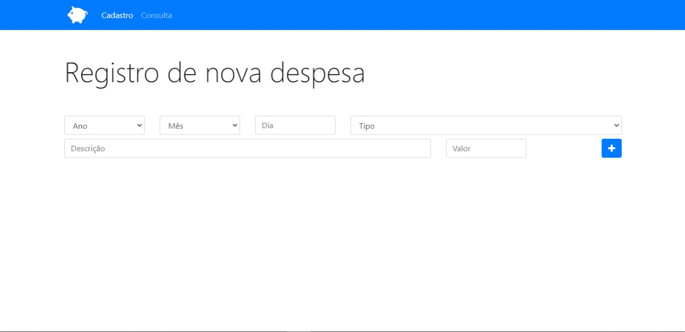
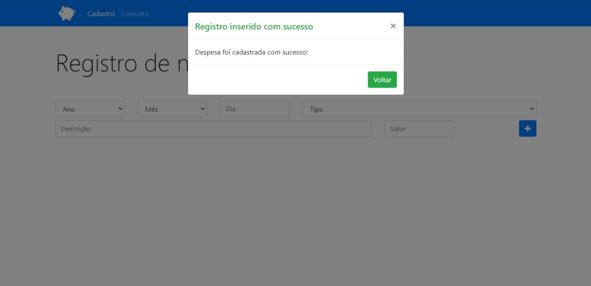
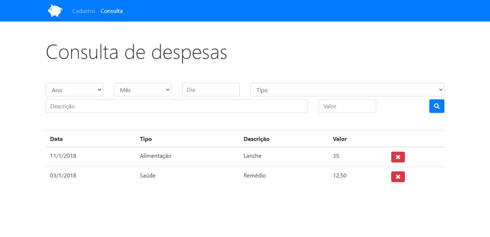

<<<<<<< HEAD
<h1 align="center">
    App Orçamento Pessoal
  
</h1>

<p align="center">
  <a href="#-projeto">Projeto</a>&nbsp;&nbsp;&nbsp;|&nbsp;&nbsp;&nbsp;
  <a href="#-tecnologias-utilizadas">Tecnologias Utilizadas</a>
</p>

<br>

<p align="center">
  

</p>

<br>

<p align="center">
  
  
  
</p>

<br/>
<br/>

## 💻 Projeto

O App Orçamento Pessoal é um app para registrar despesas e controlar os gastos, podendo fazer consultas de despesas pelo tipo, dia, descrição...

<br/>
<br/>

## ✨ Tecnologias utilizadas

Esse projeto foi desenvolvido com as seguintes tecnologias:

- [JavaScript (ES6)](https://reactjs.org)
- [Html5](https://www.typescriptlang.org/)

<br/>
<br/>


**Clone o projeto**

```bash
  gh repo clone kaicLimaOliveira/App_Orcamento_Pessoal
```

O aplicativo estará para acesso em seu navegador em: `http://localhost:3000`

<br/>
<br/>

<a href="https://kaicLimaOliveira.github.io">
 
 <br />
 <sub><b>Kaic de Lima Oliveira</b></sub></a>

Feito por Kaic de Lima Oliveira 👋🏽 Entre em contato!

[](https://www.facebook.com/kaic.oliveira.587) [](https://www.instagram.com/kaic.lo)
[](mailto:kaic10@outlook.com)
# App Orçamento Pessoal
=======
# App_Orcamento_Pessoal
Um aplicativo para controle de gastos!
>>>>>>> 579f7047d2d763e6d411b612464231862c280909
